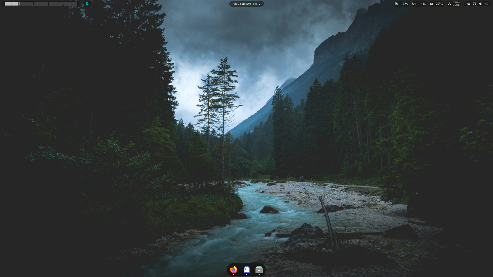

<div align="center">

# Gzito

**Rice minimalista para GNOME · píldoras flotantes · atajos propios**


</div>

## Capturas



## Qué incluye

| Apartado | Detalle |
| --- | --- |
| Barra | Píldoras flotantes transparentes, indicadores a la izquierda, reloj al centro, monitores a la derecha |
| Dock | Dash to Dock abajo, auto-oculto, iconos 32, indicadores en puntos |
| Terminal | Ghostty `#0e0e12`, JetBrainsMono Nerd Font 12, splits y atajos |
| Tema | GTK Everforest verde oscuro · iconos Papirus-Dark (carpetas amarillas) · cursor Capitaine claro |
| Extras | Astra Monitor (CPU/RAM/GPU/NET), Caffeine, AppIndicator, Blur, Betterfox + DoH Mullvad |

## Instalar (Arch/CachyOS o Fedora)

```bash
git clone https://github.com/AZIT0/Gzito; cd Gzito; ./install.sh
```

El script pregunta al final por Chaotic-AUR, Flatpak y Firefox/Zen. Al terminar: cerrar sesión y entrar.

## Desinstalar

```bash
cd Gzito; ./rice-uninstall.sh
```

Devuelve GNOME a fábrica y borra la carpeta del repo.

## Atajos

| Teclas | Acción |
| --- | --- |
| `Super+Enter` / `Super+W` / `Super+E` | Terminal / Navegador / Archivos |
| `Super+Q` / `Super+F` | Cerrar / Fullscreen |
| `Super+A` / `Alt+F2` | Apps / Ejecutar comando |
| `Super+1..5` / `Super+Flechas` | Ir a escritorio |
| `Super+Ctrl+1..5` / `Super+Ctrl+Flechas` | Mover ventana |
| `Print` / `Shift+Print` / `Alt+Print` | Captura UI / Pantalla / Ventana |
